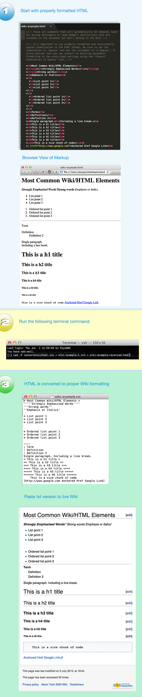

<h1>Convert-HTML-to-Wiki-with-SED-and-Regex</h1>
Convert HTML formatted README files and Documentation into properly formatted Wiki Documents with a single line via the Command Line Tool. 

<strong>Steps:</strong>
<ol>
  <li>$ cd /path/to/project/</li>
  <li>Download or Clone this Repo and move the three setup files (wiki.html, wiki.txt, converthtml2wiki.txt) into your project directory, or wherever your Wiki document is located.</li>
  <li>Edit the file 'wiki.html' using your favorite code editor, or any interface that creates HTML tags**</li>
  <li>Run the following command: <strong>$ sed -f converthtml2wiki.txt < wiki.html > wiki.txt</strong></li>
  <li>To convert Wiki back to HTML run the following command: <strong>$ sed -f convertwiki2html.txt < wiki-example-2.txt > wiki-example-reversed.html</strong> </li>
</ol>
<h5>That's it!</h5>
Your HTML formatted Wiki contents from the file 'wiki.html' will now be properly formatted for Wiki and saved into the file called 'wiki.txt'. To share the newly formatted Wiki simply copy/paste to your public or private Wiki URL.

<em>** Note:</em> You can even use Wordpress to generate your HTML tags by creating a new Post/Page using the 'Visual Editor', then change to HTML mode and Copy the generated HTML version of your content. 

<h2>Visual Instructions</h2>

The following information gives some general insight into the command line tool and the use of sed with regex. It is not necessary to read any futher to use the tool, rather follow the instructions above and get back to coding or writing Wiki documentation - in HTML ;)

<h3>Reverse Process - convert Wiki to HTML</h3>
Tips: it is best to convert small sections of a Wiki back to HTML if the original Wiki was not drafted using this tool. 

There are some tweaks to the HTML that are required to be done manually for the HTML to be valid (if that is required) if the Wiki was not originally created using this tool. This includes:
<ul>
<li><strong>Close List Tags:</strong> LI, UL, OL elements will not include the self closing tags. This should be done using the Autoclose shortcuts listed below.</li>
<li><strong>Line Breaks</strong> Paragraphy and Bread tags may not be handled in the desired way if the original Wiki was not created using this tool. The document should be reviewed for correct spacing.</li>
</ul>

  <em>** Note: The manually processes above should only have to be done once when creating a master wiki.html document. Subsequent edits should be done in the wiki.html document and outputted to the wiki.txt document for upload.</em>

<!-- sed -f converthtml2wiki.txt < wiki-example.html > wiki-example.txt -->

<strong>Autoclose Open Tags (Sublime Text)</strong>

<ul>
  <li>For Mac: Alt + Command + .</li>
  <li>For PC: Alt + .</li>
  <li>For Linux: Alt + .</li>
</ul>

<h3>Sed Overview</h3>
General information about using $ sed http://en.flossmanuals.net/command-line/sed/. 

<blockquote>
  <ul>
    <li>$ matches the end of a line</li>
    <li>^ matches the start of a line</li>
    <li>* matches zero or more occurrences of the previous character</li>
    <li>[] any characters within the brackets will be matched</li>
  </ul>
</blockquote>

<h3>Example: Simple Test</h3>
$cd /path/to/project/ 
Create textfile.txt in your directory 
Add test file contents:
<blockquote>this has foo then bar then foo then bar 
this has bar then foo then bar then foo</blockquote>

<blockquote>$ cat testfile 
# Expected Output of File Contents 
this has foo then bar then foo then bar 
this has bar then foo then bar then foo</blockquote>

<blockquote>$ sed "s/foo/bar/g" testfile.txt > testfilechanged.txt
$ cat testchangedfile 
# Expected Output of File Contents 
this has bar then bar then bar then bar 
this has bar then bar then bar then bar</blockquote>

<h4>File Permissions</h4>
If you are not seeing the expected results being written to the file you may need to change the file permissions using <em>chmod</em>.

<h3>$ sed General Examples</h3>
Replace word based on subset of letters:

For example, you could change any instance of the words "cat", "can", and "car" to "dog" by using the following:
<blockquote>$ sed "s/ca[tnr]/dog/g" inputfile > outputfile</blockquote>

In the next example, the first [0-9] ensures that at least one digit must be present to be matched. The second [0-9] may be missing or may be present any number of times, because it is followed by the * metacharacter. Finally, the digits are removed because there is nothing between the second and third slashes where you can put your replacement text.
<blockquote>$ sed "s/[0-9][0-9]*//g" inputfile > outputfile</blockquote>

Inside an expression, if the first character is a caret (^), Sed matches only if the text is at the start of the line.
<blockquote>$ echo dogs cats and dogs | sed "s/^dogs/doggy/"</blockquote>
doggy cats and dogs

A dollar sign at the end of a pattern expression tells Sed to match the text only if it is at the end of the line.
<blockquote>$ echo dogs cats and cats | sed "s/cats$/kitty/"</blockquote>
dogs cats and kitty

A line changes only if the matching string is where you require it to be; if the same text occurs elsewhere in the sentence it is not be modified.

Sed can be passed more than one operation at a time. We can do this by specifying each pattern after an -e option.
<blockquote>$ echo Gnus eat grass | sed -e "s/Gnus/Penguins/" -e "s/grass/fish/"</blockquote>
Penguins eat fish.

<h2>Scripting SED commands</h2>
By using the -f argument to the sed command, you can feed Sed a list of commands to run. For example, if you put the following patterns in a file called sedcommands:

<blockquote>
s/foo/bar/g 
s/dog/cat/g 
s/tree/house/g 
s/little/big/g 
</blockquote>

